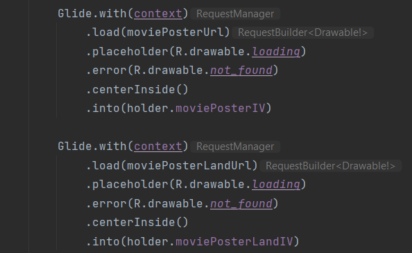

# Android Project 3 - *Movies Galore*

Submitted by: **Karan Komal**

**Movies Galore** is a movie browsing app that allows users to browse movies currently playing in theaters.

Time spent: **6.5** hours spent in total

## Required Features

The following **required** functionality is completed:

- [X] **Make a request to [The Movie Database API's `now_playing`](https://developers.themoviedb.org/3/movies/get-now-playing) endpoint to get a list of current movies**
- [X] **Parse through JSON data and implement a RecyclerView to display all movies**
- [X] **Use Glide to load and display movie poster images**

The following **optional** features are implemented:

- [X] Improve and customize the user interface through styling and coloring
- [X] Implement orientation responsivity
  - App should neatly arrange data in both landscape and portrait mode
- [X] Implement Glide to display placeholder graphics during loading
  - Note: this feature is difficult to capture in a GIF without throttling internet speeds.  Instead, include an additional screencap of your Glide code implementing the feature.  (<10 lines of code)
  - Screecap:
  

The following **additional** features are implemented:

- [X] Rating of any given movie is displayed under the title of it. In classic Hollywood fashion, it's displayed using stars!
- [X] Long pressing on any movie opens its' respective IMDB page

## Video Walkthrough

Here's a walkthrough of implemented user stories:

<!-- Replace this with whatever GIF tool you used! -->
GIF created with [ShareX](https://getsharex.com/). 
<!-- Recommended tools:
[Kap](https://getkap.co/) for macOS
[ScreenToGif](https://www.screentogif.com/) for Windows
[peek](https://github.com/phw/peek) for Linux. -->

## Notes

The challenges mostly came from the API portion of the code. The provided API Key was just not working, and I bashed my head against the wall for a while figuring that out. Eventually, I made my own account with TMDB, and I used the Access Token to get the information I needed. Then, figuring out how to properly decipher the API information took a bit of time as well. The rest of the time was mostly spent theming the app and getting it how I wanted to.

## License

    Copyright 2023 Karan Komal

    Licensed under the Apache License, Version 2.0 (the "License");
    you may not use this file except in compliance with the License.
    You may obtain a copy of the License at

        http://www.apache.org/licenses/LICENSE-2.0

    Unless required by applicable law or agreed to in writing, software
    distributed under the License is distributed on an "AS IS" BASIS,
    WITHOUT WARRANTIES OR CONDITIONS OF ANY KIND, either express or implied.
    See the License for the specific language governing permissions and
    limitations under the License.